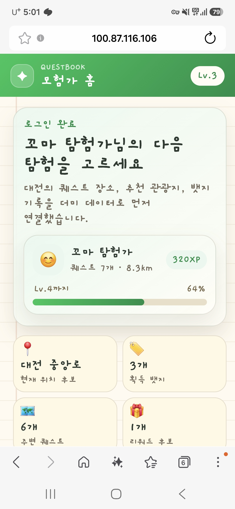
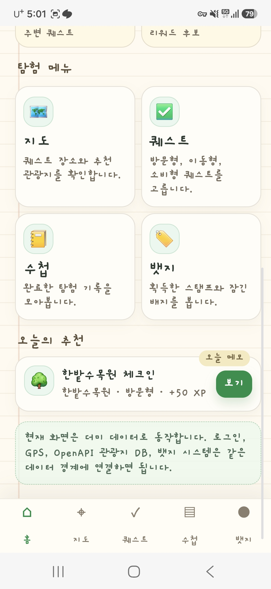
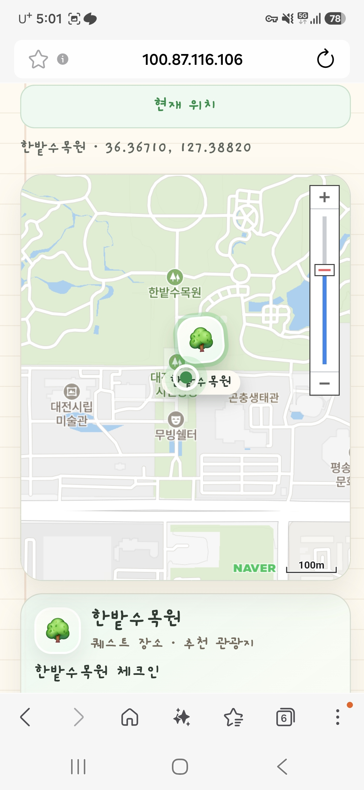

# Questbook_Daejeon

대전을 탐험하고 퀘스트를 완료해 뱃지와 꿈돌이를 수집하는 위치 기반 관광 퀘스트 게임

## 현재 통합 기준 (2026-09-15)

이번 통합은 **main의 Stitch UI와 기존 planMode 백엔드 기능**을 기준으로 한다. 카테고리 XP에 따른 기존 뱃지·꿈돌이 해금과 기존 사용자 기록을 보존하며, 퀘스트별 고유 보상으로 전환하지 않는다.

- 범위·검증 기준: [main UI 백엔드 통합](docs/main-ui-backend-integration.md).
- 관광지 수집·공용 퀘스트·수락 기록 보존·배포: [퀘스트 카탈로그 운영](docs/quest-catalog-operations.md).
- v2 고유 보상 SQL은 [미적용 제안](database/proposals/quest_reward_pairs_v2.sql)으로 분리했다. 현재 DB 초기화나 마이그레이션에 실행하지 않는다.
- 독립 게스트·소셜 기록 병합, 축제 회차별 보상, 날씨 제공, 계정 영구 삭제는 후속 확장이다.

아래 2026-09-10 인수인계는 v2 전체 확장에 관한 과거 제안이다. 그 문서의 보상 전환과 신규 API 요구 전체를 이번 통합의 완료 조건으로 사용하지 않는다.

## 프론트엔드 v2 인수인계 기록 (2026-09-10)

**현재 상태: 프론트엔드 v2 화면과 상호작용이 구현되어 있으나, 실제 백엔드와의 통합은 아직 완료되지 않았다.** UI·보상·데이터 계약의 기준은 [FRONTEND_SPEC.md](FRONTEND_SPEC.md)이며, 이 README 아래의 기존 주요 기능·실행 설명과 [PROJECT_DESIGN.md](docs/PROJECT_DESIGN.md), [MVP_STATUS.md](docs/MVP_STATUS.md)에는 v1 baseline 설명이 남아 있다. 특히 카테고리 XP에 따른 단계별 해금을 v2의 퀘스트별 고유 보상과 혼동하지 않는다.

### main 비교와 브랜치 상태

- 원격 최신 `main`: `6cc4779` (`Merge pull request #4 from baeseongjin123/ui/ggumdori-redesign`).
- 프론트엔드 작업: `feat/reward-fx`의 아래 4개 커밋. 비교 시점에 `main`에만 있는 커밋은 0개, 프론트엔드에만 있는 커밋은 4개이며 작업 트리는 깨끗했다.
- 이력상 fast-forward 병합은 가능하지만, `/api/catalog` 등 신규 API 부재와 보상 모델 불일치가 있어 **main 통합은 보류**한다.
- 전달 브랜치: `docs/frontend-v2-backend-handoff`. 기존 프론트엔드 커밋 전체와 이 인수인계 문서를 포함한다. 아래 백엔드 작업과 통합 검수를 마친 뒤 main에 병합한다.

| 커밋 | 개발·수정 내용 |
| --- | --- |
| `97311d3` | v2 명세 추가, 다섯 최상위 화면과 우측 책갈피 드로어, 홈 지도 통합, Stitch 픽셀 HUD 테마, 기존 경로·카테고리 호환 처리 |
| `34504cb` | 꿈돌이 정지·눈깜빡임·썸네일 에셋과 매니페스트 생성 파이프라인, 퀘스트 보상 시드 생성 도구, v2 보상 DB 마이그레이션 파일 추가 |
| `355cb53` | 모험 중·퀘스트·도감·2D 촬영·마이페이지·계획·날씨 화면, 보상 연출, 계정 연결 UI, PWA 캐시·접근성 처리 |
| `997f089` | 드로어 메뉴를 눌러도 홈으로 돌아가던 history 경쟁 문제 수정, 뒤로가기 시 열린 시트를 먼저 닫도록 처리 |

### 프론트엔드에서 구현한 범위

| 영역 | 현재 구현 |
| --- | --- |
| 화면 구조·디자인 | Vanilla HTML/CSS/JS와 해시 라우팅 유지. 홈·모험 중·퀘스트·도감·마이페이지로 재편, 우측 드로어, 메뉴 간 책장 넘김, 홈 지도와 3단계 시트, v2 카테고리·아이콘·테마 적용 |
| 탐색·계획 | 현위치/계획 모드, 위치 검색 요청·지도 중심 위치 설정, 단일 날짜 선택, 계획 정보 복원, 날씨 요약·상세 및 실패/미제공 상태 표시 |
| 퀘스트 | 진행 중 목록, 목록/카드 전환, 필터·정렬·상태 표시, 공용 상세 시트, 장소명·주소 복사, 인증 흐름, 실제 행사 타깃 선택 |
| 보상·도감 | `rewardPair` 기반 뱃지·꿈돌이 연출, 서버 도감 조회와 fallback, 검색·필터·상세·잠금 표시, 대표 꿈돌이 선택 및 저장 요청 |
| 촬영·기록 | 카메라 또는 선택 사진 위에 획득 꿈돌이를 Canvas로 2D 합성, PNG 저장·공유, 월별 모험 기록과 공유 카드 |
| 계정·설정 | 온보딩·동의·닉네임 단계, 게스트/소셜 표시와 연결 UI, 연결 실패 시 게스트 토큰 보존, 음량·알림·모션·권한·약관·탈퇴 UI |
| PWA·접근성 | 앱 셸과 보상 이미지 캐시 분리, 캐시 상한·정리, 새 버전 적용 안내, 민감 응답 캐시 제외, 포커스 트랩·reduced motion·터치 영역 처리 |

위 표는 코드에 구현된 범위다. 목업 응답, 브라우저 저장, API 실패 시 fallback으로 표시되는 부분이 있으므로 화면이 보이는 것만으로 서버 저장·실제 보상 지급·계정 승계가 완료됐다고 판단하지 않는다.

### 백엔드에서 이어서 수정할 내용

**P0 — main 통합 전 필요한 데이터·계정·인증 작업**

1. **v2 보상 DB와 기존 데이터 이관**
   - [v2 보상 SQL 제안](database/proposals/quest_reward_pairs_v2.sql)에 `quest_rewards`, `user_quest_rewards`, `festival_visits` 정의가 있다. 현재 통합에서는 실행하지 않는다. 향후 보상 정책 전환을 승인할 때 별도 이관 절차와 함께 검토한다.
   - `assets-src/ggumdori/quest-mapping.json`을 작성하고 [seed_quest_rewards.mjs](scripts/seed_quest_rewards.mjs)로 시드를 생성·검토한다. 현재 Git에는 매핑 파일이 없으므로 생성 도구만 실행해서는 보상 연결이 완성되지 않는다. 실제 퀘스트 ID와 고유 뱃지·꿈돌이를 매핑해야 한다.
   - 기존 카테고리·뱃지·꿈돌이·대표 선택 이관 정책을 확정한다. 003의 카테고리 UPDATE는 일부 `reusable_quests`만 처리하므로 기존 사용자 보상 전체의 이관까지 완료한 것이 아니다.
2. **퀘스트별 1:1:1 보상 지급**
   - 현재 `repository.complete_quest()`는 카테고리 XP로 뱃지와 꿈돌이를 해금한다. 공개 퀘스트 최초 완료 시 고유 뱃지와 꿈돌이를 같은 트랜잭션에서 지급하도록 변경한다. XP는 사용자 전체 레벨에만 사용한다.
   - 사용자·퀘스트 기준 중복 지급을 막고, 동시 요청·재시도에도 최초 보상 한 번만 지급한다. 추천 및 완료 응답에 명시적 이미지 참조를 포함한 `rewardPair`와 실제 지급 결과를 반환한다.
3. **동적 도감과 대표 선택 저장**
   - 도감 API, 획득 여부·개수·커서 조회, 대표 꿈돌이 저장/복원을 구현한다. 기본 꿈돌이는 전체 수에서 제외하고 draft는 숨기며, paused/retired 항목은 순서와 슬롯을 유지한다.
   - 대표 설정은 서버에서 보유 여부를 검사한다. 종료된 퀘스트라도 이미 획득한 캐릭터는 계속 대표 설정과 촬영에 사용할 수 있어야 한다.
4. **독립 게스트 계정과 소셜 승계**
   - 현재 비회원 진입은 `POST /api/auth/demo-login`에 고정 `providerUserId: "demo-user"`를 보낸다. 운영용으로는 사용자별 독립 게스트 ID·세션 발급으로 교체해야 한다.
   - 기존 네이버·Google OAuth 구현을 기반으로 게스트 기록·보상·대표 선택·동의를 소셜 계정에 승계한다. 기존 소셜 계정과 충돌할 때의 병합 규칙과 재시도 처리도 필요하다.
   - `/api/me`에 `accountType`, `nickname`, `email`, `provider`, 레벨·XP, `selectedGgumdoriId`를 제공하고 닉네임 저장·탈퇴를 구현한다. 이용약관 동의는 현재 화면에서만 확인하므로 요청과 서버 동의 기록도 맞춘다.
5. **인증·축제 방문의 서버 판정**
   - 실제 GPS·현재 시각으로 인증하고 계획 위치·날짜와 분리한다. 방문/이동/활동/소비/테마형 정책과 기존 인증 코드를 맞춘다. 이동형 출발·도착 체크포인트 및 테마형 하위 완료 검증은 추가 구현이 필요하다.
   - 현재 소비형 OCR 등은 보조 검사이며 완료 여부는 GPS 중심이다. v2 정책에 맞춰 사진·OCR/QR 등의 필수 조건과 실패 응답을 확정한다.
   - 완료 요청의 `canonicalQuestId`, `eventId`, `editionId`를 실제 공개 퀘스트와 행사에 대조하고 서버에서 유효 기간·좌표·방문 중복을 검증한다. 최초 축제 완료만 보상과 XP를 지급하고 다른 회차 추가 방문은 기록만 저장한다. 브라우저 방문 기록만으로 중복 지급을 판단하지 않는다.

**P1 — 탐색 API와 계약 정합성**

| API/계약 | 현재 차이 및 필요한 작업 |
| --- | --- |
| `GET /api/catalog?cursor=...` | 프론트 호출은 있으나 서버 라우트 없음. `earnedCount`, `totalCount`, `entries`, `nextCursor`와 명세 §16.3의 도감 항목 반환 |
| `POST /api/me/ggumdori` | 서버 라우트 없음. `{ selectedGgumdoriId }`를 검증·저장하고 `/api/me`와 도감에서 복원 |
| `POST /api/me/nickname` | 서버 라우트 없음. `{ nickname }` 저장·검증. 현재 화면의 로컬 변경을 영구 저장으로 연결 |
| `DELETE /api/me` | 서버 처리 없음. 계정·기록·토큰·사진 등의 삭제 정책을 정하고 실제 탈퇴 처리 |
| `GET /api/weather?lat=...&lng=...&date=...` | 서버 라우트 없음. 위치·KST 날짜 기준 예보, 기온·강수확률·시간별 예보, 범위 밖/실패 상태와 캐시 구현 |
| `GET /api/places/search?query=...` | 서버 라우트 없음. 기존 `/api/naver-map/geocode`와 연결하거나 계약을 통일하고 이름·주소·위경도 반환 |
| `GET /api/recommendations` | 현재 프론트는 `lat`, `lng`, `category`, 선택적 `refresh`만 전달하고 서버도 계획 날짜를 처리하지 않음. mode/date 전달과 날짜별 행사 필터·추천·캐시 키를 함께 수정 |
| 추천·완료 응답 | `questId`, `difficulty`, `questType`, `startedAt`, 수행 가능 기간, `rewardPair`, 공통 축제 여부·타깃 등을 명세 §16 및 프론트 정규화 함수와 통일 |
| OpenAPI·기존 설계 | [baseline-api.yaml](contracts/openapi/baseline-api.yaml), `PROJECT_DESIGN.md`, `MVP_STATUS.md`를 v2 구현과 맞추고 API·DB·회귀 테스트 갱신 |

### 서버 연동 후 프론트엔드에서 함께 마무리할 부분

- `loadRecommendations()`에 계획 모드·날짜를 전달하고 서버의 필터 결과와 화면 상태를 맞춘다.
- `loadCatalog()`는 정상 응답의 빈 목록에도 fallback을 표시한다. 실제 `totalCount: 0`인 빈 도감과 API 실패를 구분하고, 완료 후 도감을 다시 조회해 새 보상·개수를 반영한다.
- 대표 꿈돌이·닉네임은 저장 실패에도 로컬 표시가 남으므로 저장 상태와 재시도/복원 동작을 맞춘다.
- `triggerRewardFx()`의 보상 연출과 축제 추가 방문 판단을 서버의 실제 지급 결과에 연결한다. 현재 퀘스트 메타데이터와 로컬 방문 이력만으로 최종 지급 결과를 대신하지 않도록 정리한다.
- 게스트 발급·계정 병합 API에 진입/연결 UI를 연결하고 이동형 체크포인트 등 새 인증 요청·응답을 반영한다.

### 확인 방법과 이번 검토 범위

화면만 확인할 때는 다음 개발 서버를 사용한다. 이 서버의 `/api` 응답은 목업이며 운영 백엔드 검증용이 아니다.

```bash
node apps/user-web/dev-server.mjs
# http://127.0.0.1:4173/
```

- 이번 인수인계 검토에서 원격 main을 fetch해 비교했고, 변경된 JavaScript/MJS 7개 파일의 `node --check`가 모두 통과했다.
- 기존 프론트엔드 커밋에는 메뉴 이동·시트 뒤로가기·회귀 검증 기록이 있다. 이번 문서 작업에서 브라우저 실기기 검수, DB 마이그레이션 적용, 실제 API 통합 테스트를 새로 실행한 것은 아니다.
- main 병합 전 확인: 독립 게스트 두 명의 기록 분리 → 실제 퀘스트 수락/인증 → 보상 동시 지급·중복 방지 → 도감/대표 재로그인 복원 → 소셜 승계 → 계획 날짜별 추천/날씨 → 축제 추가 방문 → 계정 삭제.
- 화면 회귀는 명세 §19를 기준으로 360~430px, 뒤로가기, 카메라/사진 저장, 위치 권한 거부, 오프라인, PWA 업데이트, 키보드·reduced motion을 확인한다.

## 문서 구조

- `docs/PROJECT_DESIGN.md`: 목표 기능, 데이터 정책, 시스템 아키텍처, 네트워크 구조, 확장 설계
- `docs/MVP_STATUS.md`: 현재 구현 현황, 미구현 기능, 다음 구현 작업
- `docs/Design.md`: 원본 요구사항 메모
- `docs/deploy-cloud.md`: 테스트 VM 이미지 빌드부터 Registry, 다중 VM, ALB, 롤백까지의 클라우드 배포 런북
- `docs/object-storage-setup.md`: NCP Object Storage 사진 증빙 저장 준비 절차
- `docs/clova-ocr-setup.md`: NCP CLOVA OCR 도메인·API Gateway·키·실제 영수증 검증 연동 절차

## 샘플 이미지

*메인 화면 예시 1*

*메인 화면 예시 2*

*지도 화면 예시*


## 주요 기능

설치 가능한 모바일 웹(PWA)으로 제작된 웹 애플리케이션이며, MVP는 설치와 기본 오프라인 캐싱을 제공하고 웹 푸시·풀 오프라인은 향후 확장한다.
한국관광공사 OpenAPI와 GPS, 사진 등을 이용하여 아래의 기능을 제공

### 1. 대전 관광 퀘스트 제공

OpenAPI 관광지 데이터를 기반으로 방문형, 이동형, 활동형, 소비형, 테마형 퀘스트를 제공한다.
사용자는 현재 위치와 관심 테마에 따라 주변 퀘스트를 확인하고 원하는 것을 선택해 수행할 수 있다.
한밭수목원 방문, 국립중앙과학관 탐방, 원도심 걷기, 타슈를 이용한 이동, 지역 빵집 방문, 전통시장 소비 인증 등 대전 특화 퀘스트를 제공한다.

### 2. 퀘스트 인증 및 뱃지 발급

관광지 반경 10~50m 도달 시 GPS 기반으로 1차 인증하고, MVP의 사진 인증은 사진 존재와 완료 시각·위치창을 확인하는 경량 검증으로 둔다.
소비형은 OCR로 상호명만 추출해 기대 장소와 대조하며, 금액·카드·승인번호 등 민감 영수증 필드는 저장하지 않는다.
퀘스트 완료 시 모험 수첩에 도장이 찍히고 활동 유형에 따라 뱃지를 획득한다.
뱃지는 단순 보상이 아닌 관광 행동 데이터 태그로 활용되며, 타슈 라이더, 빵지순례자, 사이언스 익스플로러, 대전 워커 등 관광 성향을 반영한 종류로 구성된다.
뱃지 단계는 `docs/PROJECT_DESIGN.md` §4.7의 수집형 꿈돌이 도감 해금 조건으로 사용된다.

### 3. 나만의 모험 수첩 기능

완료한 퀘스트, 방문 장소, 획득 뱃지, 이동 기록을 개인화 기록장 형태로 시각화한다.
뱃지와 퀘스트 결과는 시스템 생성 카드(닉네임·장소·뱃지·꿈돌이)로 저장 및 공유할 수 있다.
원본 사진은 비공개로 본인 수첩에 보관한다.

### 4. 위치기반 맞춤 퀘스트 추천 기능

MVP에서는 뱃지 획득 이력을 기반으로 관광 성향에 맞는 퀘스트를 개인화 추천한다.
연관 관광지 API와 집중률 API를 활용한 혼잡 분산 추천은 향후 고도화 기능으로 두며, 실교통량·내비게이션 데이터 연계가 필요하다.

### 5. 리워드 및 지역상권 연계

일정 퀘스트 달성 또는 특정 테마 뱃지 획득 시 지역상점 할인 쿠폰, 관광기념품, 체험권 등 리워드를 제공한다.
MVP 단계에서는 뱃지, 모험 수첩, 꿈돌이 도감 같은 비금전 보상 중심으로 운영하고, 실금전 리워드는 이후 대전 지역상점, 전통시장, 지역 축제와 연계해 확장한다.

## 로컬 실행 및 네이버 지도 설정

현재 저장소에는 두 실행 경로가 있다.

- 아카이브된 정적 프로토타입: `legacy/static-mvp/`의 `index.html`, `map.html`, `quests.html`, `notes.html`, `badges.html`, `server.py` (참조·데모용 보존)
- baseline 분리 구현: `apps/user-web`, `services/web-gateway`, `services/app-api`

baseline 분리 구현은 설계서의 확장 이전 구조에 맞춰 사용자 PWA, 웹 게이트웨이, Python 앱 API, PostgreSQL 저장소, Redis 캐시 계층을 분리한다. 로컬 `uv` 실행 경로에서는 Docker Compose로 PostgreSQL과 Redis 서비스만 먼저 기동한다. 웹·앱 API까지 컨테이너로 포함한 전체 스택은 저장소 루트에서 `docker compose up -d --build`로 기동한다. 실제 한국관광공사 TourAPI를 쓰려면 공공데이터포털에서 `한국관광공사_국문 관광정보 서비스_GW` 활용신청 후 `.env`에 `TOURAPI_SERVICE_KEY`를 넣는다. 브라우저 코드에는 키를 넣지 않고 앱 API가 서버 측에서 호출한다.

NCP Object Storage 사진 증빙 저장은 `docs/object-storage-setup.md`를 따른다. 앱 API는 `boto3`로 비공개 버킷에 접근하며, 브라우저에는 API 키를 노출하지 않고 presigned URL만 발급한다.
NCP CLOVA OCR 실제 연동은 `docs/clova-ocr-setup.md`를 따른다. 현재 구현은 General OCR의 전체 텍스트를 서버에서 받아 상호명·품목·시간을 보조 검증하며, 완료 여부는 기존 GPS 판정만 사용한다.

```bash
cp .env.example .env
# .env에서 TOURAPI_SERVICE_KEY=공공데이터포털_서비스키 를 설정
docker compose up -d postgres redis
uv run --project services/app-api python scripts/check_local_data_services.py
uv run --project services/app-api python scripts/run_baseline.py
```

실행 후 같은 PC에서는 `http://127.0.0.1:8000/`로 접속한다. 앱 API는 기본적으로 `http://127.0.0.1:8100`에서 실행되고, 웹 게이트웨이가 `/api` 요청을 앱 API로 프록시한다. 첫 화면에서는 demo-social 로그인과 만 14세 이상 확인, 개인정보·위치정보 수집·이용 동의 후 Bearer token을 받아 API를 호출한다.

컨테이너 전체 스택을 검수할 때는 `.env`의 `QUESTBOOK_JWT_SECRET`을 강한 랜덤 값으로 교체한 뒤 다음 명령을 사용한다.

```bash
docker compose up -d --build
```

baseline 검수 명령은 다음과 같다.

```bash
docker compose up -d postgres redis
uv run --project services/app-api pytest services/app-api/tests tests/smoke -v
node --check apps/user-web/src/app.js
node --check apps/user-web/public/service-worker.js
```

PostgreSQL과 Redis만 필요한 로컬 개발 서비스는 Docker Compose의 `postgres`, `redis` 서비스로 준비한다. 접속 URL 기본값은 `.env.example`과 루트 `docker-compose.yaml`에 맞춰져 있다.

```bash
docker compose up -d postgres redis
uv run --project services/app-api python scripts/check_local_data_services.py
```

Object Storage `.env` 값을 넣은 뒤 버킷 접근은 다음 명령으로 확인한다.

```bash
uv run --project services/app-api python scripts/check_object_storage.py
```

운영 baseline 보조 파일은 다음 위치에 있다.

- `infra/nginx/questbook-baseline.conf`: 정적 PWA 제공, gzip 압축, 보안 헤더, `/api` 프록시 예시
- `infra/ncp/baseline-topology.yaml`: 설계서의 NCP VPC/subnet baseline 토폴로지
- `scripts/backup_postgres.py`: 로컬 baseline PostgreSQL 백업 스크립트

아카이브된 정적 프로토타입의 지도 페이지는 NAVER Maps Dynamic Map을 사용한다. 브라우저에는 `NAVER_MAPS_API_KEY_ID`만 전달하고, `NAVER_MAPS_API_KEY`는 로컬 서버의 Geocoding, Reverse Geocoding 프록시에서만 사용한다.

```bash
cp .env.example .env
uv run python legacy/static-mvp/server.py
```

`.env`에 다음 값을 입력한 뒤 `http://100.87.116.106:8000/index.html`로 접속한다. 같은 PC에서는 `http://127.0.0.1:8000/`도 사용할 수 있다.

```dotenv
NAVER_MAPS_API_KEY_ID=your_key_id
NAVER_MAPS_API_KEY=your_api_key
QUESTBOOK_HOST=0.0.0.0
QUESTBOOK_PORT=8000
QUESTBOOK_PUBLIC_URL=http://100.87.116.106:8000
```

NAVER Cloud Platform 콘솔에서 Maps 애플리케이션의 Web 서비스 URL 또는 Referer 허용 목록에 Tailscale 주소 `http://100.87.116.106:8000` (단순 예시), 로컬 주소 `http://127.0.0.1:8000`, 배포 도메인을 등록해야 Dynamic Map이 정상 로드된다. 키가 비어 있거나 도메인 설정이 맞지 않으면 지도 페이지는 기존 목업 지도로 fallback된다.
