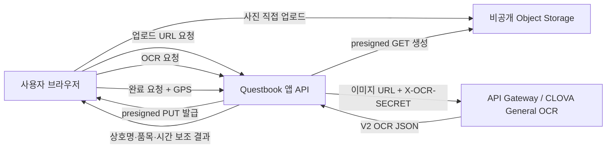

# NCP CLOVA OCR 실제 연동 가이드

문서 확인 기준일: 2026-07-12

이 문서는 CLOVA OCR 이용 신청을 마친 상태에서 Questbook의 영수증 사진 OCR을 실제 Naver Cloud Platform 서비스와 연결하는 절차를 설명한다. 콘솔 메뉴나 요금은 변경될 수 있으므로, 실제 적용 직전에는 문서 끝의 공식 링크와 콘솔 표시를 한 번 더 확인한다.

## 1. 먼저 결론

현재 Questbook에는 다음 방식이 맞다.

- OCR 도메인 유형: **General OCR**
- API 연동 방식: **API Gateway 자동 연동**
- 앱이 저장할 필수 OCR 값: **APIGW Invoke URL**, **OCR Secret Key**
- 이미지 전달 방식: 비공개 Object Storage 객체의 짧은 만료 시간 **presigned GET URL**
- OCR 호출 위치: 브라우저가 아니라 **Questbook 앱 API 서버**
- OCR 결과 용도: 상호명·품목·시간 텍스트의 **보조 검증**
- 최종 완료 판정: 기존 정책대로 **GPS만 결정 기준**이며 OCR 불일치가 완료를 막지 않음

현재는 `Document OCR`의 영수증 특화 모델을 신청할 필요가 없다. Questbook 코드는 General OCR이 반환한 전체 문자를 자체 함수로 비교하도록 작성되어 있다. Document OCR은 구조화된 영수증 필드를 제공하지만 별도 사전 승인과 다른 요청·응답 처리가 필요하므로, Invoke URL만 교체해서 사용할 수 없다.

공식 문서:

- [CLOVA OCR 시작](https://guide.ncloud-docs.com/docs/clovaocr-start)
- [General 도메인 생성 및 사용](https://guide.ncloud-docs.com/docs/ko/clovaocr-general)
- [Domain 및 API Gateway 연동](https://guide.ncloud-docs.com/docs/clovaocr-domain)
- [General OCR API](https://api.ncloud-docs.com/docs/ai-application-service-ocr-ocr)

## 2. 현재 위치와 전체 순서

사용 신청만 마친 현재 상태는 아래 1번이 끝난 상태다.

1. CLOVA OCR 이용 신청
2. General OCR 도메인 생성
3. 콘솔 데모로 OCR 자체 동작 확인
4. API Gateway 자동 연동
5. APIGW Invoke URL과 OCR Secret Key 보관
6. Questbook `.env` 또는 운영 비밀 저장소에 값 등록
7. Object Storage 연결 확인
8. 앱 API 재기동
9. 설정 상태 확인
10. 실제 영수증으로 종단 간 테스트
11. 모니터링·과금·키 회전 설정



브라우저에는 `NCP_CLOVA_OCR_SECRET_KEY`나 Object Storage Access Key를 절대 전달하지 않는다.

## 3. General OCR을 선택하는 이유

| 유형 | 용도 | Questbook 현재 적합성 |
| --- | --- | --- |
| General OCR | 이미지 전체 텍스트 추출 | **현재 사용**. 기존 `fields[].inferText` 파서와 일치 |
| Template OCR | 고정된 문서 양식의 지정 영역 추출 | 영수증 양식이 매장마다 달라 부적합 |
| Document OCR 영수증 | 영수증을 매장·품목·결제 정보로 구조화 | 향후 고도화 후보. 사전 승인과 코드 변경 필요 |

Document OCR 영수증 특화 모델은 메인 계정으로 별도 신청해야 하며 승인에는 공식 안내 기준 영업일 약 3일이 걸릴 수 있다. 또한 General OCR은 JSON 요청에서 이미지 URL을 받을 수 있지만 Document OCR 영수증 API는 현재 JSON 요청에서 Base64 `data`를 요구하므로, 기존 클라이언트에 Document URL을 넣으면 동작하지 않는다.

참고:

- [Document OCR 안내](https://guide.ncloud-docs.com/docs/en/clovaocr-document)
- [Document OCR 영수증 API](https://api.ncloud-docs.com/docs/ai-application-service-ocr-ocrdocumentocr-receipt)
- [CLOVA OCR 일반적인 문제](https://guide.ncloud-docs.com/docs/clovaocr-troubleshoot-common)

## 4. 별도로 보관해야 하는 값

### 4.1 OCR 필수 값

| 콘솔에서 복사할 값 | 프로젝트 환경 변수 | 비밀 여부 | 설명 |
| --- | --- | --- | --- |
| **APIGW Invoke URL** | `NCP_CLOVA_OCR_INVOKE_URL` | 제한 정보 | API Gateway가 외부에 제공하는 전체 General OCR 호출 주소 |
| **Secret Key** | `NCP_CLOVA_OCR_SECRET_KEY` | **비밀** | 요청의 `X-OCR-SECRET` 헤더에 넣는 도메인 전용 키 |

Invoke URL은 보통 다음 형태이며 **`/general`까지 포함한 전체 주소**여야 한다.

```text
https://********.apigw.ntruss.com/custom/v1/<domain-id>/<invoke-key>/general
```

다음 값을 혼동하면 안 된다.

- 사용해야 하는 값: `APIGW Invoke URL`
- 사용하지 않는 값: 수동 연동 화면의 내부 `CLOVA OCR Invoke URL`
- 사용하지 않는 값: `/general` 리소스가 빠진 API Gateway Stage 기본 주소

Secret Key는 생성 직후 운영 비밀 저장소에도 보관한다. Secret Key를 재생성하면 기존 호출이 중단될 수 있으므로, 단순히 값을 잊었다는 이유로 업무 시간에 재생성하지 않는다.

### 4.2 운영 기록으로 보관할 값

아래 값은 앱 런타임에 필수는 아니지만 장애 문의와 운영 관리에 필요하다.

| 값 | 비밀 여부 | 보관 이유 |
| --- | --- | --- |
| 도메인 이름 | 아님 | 개발·운영 도메인 식별 |
| 도메인 코드 | 아님 | 콘솔 검색과 지원 문의 |
| 도메인 ID | 아님 | 호출량 증설·장애 문의 |
| 리전과 플랫폼 | 아님 | 잘못된 콘솔 위치에서 리소스를 찾는 문제 방지 |
| API Gateway Product/API/Stage 이름 | 아님 | 자동 연동 리소스 추적 |
| Secret Key 발급·교체일 | 아님 | 회전 이력 관리 |

### 4.3 OCR 호출에는 필요하지 않은 값

General OCR 호출 자체에는 다음 값이 필요하지 않다.

- NCP 계정의 일반 `Access Key ID`
- NCP 계정의 일반 `Secret Key`
- NAVER 로그인 Client ID/Secret
- NAVER Maps Key
- 브라우저용 API Key

단, Questbook가 Object Storage에 접근하려면 별도로 아래 값이 필요하다.

- `NCP_OBJECT_STORAGE_BUCKET_NAME`
- `NCP_OBJECT_STORAGE_ACCESS_KEY`
- `NCP_OBJECT_STORAGE_SECRET_KEY`

OCR Secret Key와 Object Storage Secret Key는 이름과 용도가 완전히 다른 키다.

## 5. 콘솔에서 General OCR 도메인 만들기

### 5.1 이용 상태 확인

1. [Naver Cloud Platform 콘솔](https://console.ncloud.com/)에 로그인한다.
2. 우측 상단에서 사용할 리전과 플랫폼을 확인한다.
3. `Services > AI Services > CLOVA OCR`로 이동한다.
4. `Subscription`에서 상태가 `상품 이용 중`인지 확인한다.
5. 서브 계정을 사용한다면 `NCP_OCR_MANAGER` 또는 필요한 사용자 정의 권한이 있는지 확인한다.

General OCR 도메인은 계정당 하나만 생성할 수 있다. 도메인 생성 화면에서 General을 선택할 수 없다면 이미 생성된 General 도메인이 있는지 먼저 확인한다.

권한 참고: [CLOVA OCR 권한 관리](https://guide.ncloud-docs.com/docs/clovaocr-subaccount)

### 5.2 도메인 생성

1. CLOVA OCR의 `Domain` 메뉴를 연다.
2. `도메인 생성`을 누른다.
3. `General/Template`을 선택한다.
4. 아래 기준으로 값을 입력한다.

| 항목 | 권장값 | 이유 |
| --- | --- | --- |
| 도메인 이름 | `questbook-receipt-ocr-dev` 또는 `questbook-receipt-ocr-prod` | 환경을 구분하기 쉬움 |
| 도메인 코드 | `questbook-receipt-ocr-dev` 등 | 콘솔·지원 문의에서 식별 가능 |
| 지원 언어 | 한국어 | 대전 지역 영수증이 주 대상 |
| 서비스 타입 | **General** | 현재 코드의 요청·응답 규격과 일치 |

5. 중복 확인이 필요한 필드는 `체크`를 누른다.
6. `도메인 생성`을 누른다.
7. 생성된 도메인 목록의 `표 추출 여부`는 비활성 상태로 둔다. 현재 코드는 `tables`를 사용하지 않는다.

개발과 운영을 완전히 분리하고 싶어도 General 도메인 생성 수 제한을 먼저 확인해야 한다. 하나만 만들 수 있는 계정에서는 같은 도메인을 사용하되 앱의 환경, Object Storage 버킷, 로그와 사용량을 분리한다.

## 6. API 연동 전에 콘솔 데모로 확인

도메인 생성 직후 API Gateway를 붙이기 전에 콘솔 데모를 먼저 실행한다. 이 단계가 실패하면 앱 코드나 키 문제가 아니라 도메인·이미지 문제다.

1. `CLOVA OCR > Domain`에서 생성한 General 도메인의 `데모`를 누른다.
2. 한국어를 선택한다.
3. 개인정보가 없는 테스트 영수증 JPEG 또는 PNG를 올린다.
4. 상호명, 구매 품목, 날짜 또는 시간이 인식되는지 확인한다.
5. 필요하면 JSON 결과를 내려받아 `fields[].inferText`가 존재하는지 확인한다.

공식 General OCR 제한과 권장 사항은 다음과 같다.

- 호출당 이미지 배열은 1개다.
- 최대 이미지 크기는 50MB지만 Questbook 자체 제한은 10MiB다.
- API 공식 지원 형식은 `jpg`, `jpeg`, `png`, `pdf`, `tif`, `tiff`다.
- PDF는 최대 10페이지를 지원하지만 Questbook 사진 업로드는 PDF를 받지 않는다.
- 2026-04-23부터 한국 리전 API·빌더 호출 이미지는 장축 8,000px 미만이어야 한다.
- A4 기준 150dpi 이상, 장축 1,960px 이하가 권장된다.
- 문서가 45도 이상 돌아가면 인식률이 낮아질 수 있다.

첫 실제 연동 테스트에는 **정방향 JPEG 또는 PNG**만 사용한다. 현재 Questbook 업로더가 허용하는 WebP·HEIC·HEIF는 General OCR 공식 지원 형식 목록에 없으므로 OCR 실패 가능성이 있다.

## 7. API Gateway 자동 연동과 키 발급

자동 연동이 현재 프로젝트에 가장 단순하고 공식 권장되는 방법이다.

1. `CLOVA OCR > Domain`에서 General 도메인의 `API Gateway 연동`을 누른다.
2. Invoke URL 호출용 `Secret Key` 항목에서 `생성`을 누른다.
3. 표시된 Secret Key를 복사해 비밀 저장소에 보관한다.
4. 팝업의 `확인`을 누른다.
5. `APIGW 자동 연동`의 `자동 연동`을 누른다.
6. API Gateway를 아직 신청하지 않았다면 안내 팝업에서 이용 신청을 진행한다.
7. 자동 연동이 끝나면 `APIGW Invoke URL`의 `주소 복사`를 누른다.
8. 복사한 주소가 `https://`이고 `/general`까지 포함하는지 확인한다.

API Gateway는 CLOVA OCR과 별도 서비스이며 별도 사용량이 집계된다. 공식 안내상 호출 수, 네트워크 전송량, 캐시 사용량을 기준으로 과금될 수 있으므로 최신 요금표를 확인한다.

참고:

- [Domain API Gateway 자동 연동](https://guide.ncloud-docs.com/docs/clovaocr-domain)
- [API Gateway 서비스와 요금](https://www.ncloud.com/product/applicationService/apiGateway)
- [CLOVA OCR 서비스와 요금](https://www.ncloud.com/product/aiService/ocr?region=KR)

### 수동 연동은 언제 쓰는가

IP ACL, 별도 Stage, 세밀한 API Gateway 정책이 반드시 필요할 때만 수동 연동을 고려한다. 수동 연동에서는 CLOVA OCR Invoke URL, APIGW Configuration JSON, Product, API, Stage, 배포를 직접 관리해야 한다. 처음 연동에서는 자동 연동을 사용한다.

## 8. 키를 안전하게 저장하기

### 8.1 로컬 개발

저장소 루트의 `.env`에 아래 값을 넣는다. `.env.example`에는 자리만 있으며 실제 값은 입력하지 않는다.

```ini
NCP_CLOVA_OCR_INVOKE_URL=https://********.apigw.ntruss.com/custom/v1/<domain-id>/<invoke-key>/general
NCP_CLOVA_OCR_SECRET_KEY=<OCR API Gateway 연동 화면에서 생성한 Secret Key>
NCP_CLOVA_OCR_LANGUAGE=ko
NCP_CLOVA_OCR_TIMEOUT_SECONDS=8
```

권한을 제한한다.

```bash
cd /home/ilhyeonchu/Documents/GitHub/Questbook_Dajeon
chmod 600 .env
```

`.env`는 현재 `.gitignore`에 포함되어 있다. 그래도 다음 위치에는 값을 넣지 않는다.

- `.env.example`
- JavaScript 소스
- Git 커밋
- 이슈·채팅·스크린샷
- 애플리케이션 로그
- 브라우저 Local Storage

### 8.2 운영 환경

운영에서는 NCP Secret Manager 또는 배포 환경의 비밀 저장소에 다음 키 이름으로 저장한다.

```json
{
  "NCP_CLOVA_OCR_INVOKE_URL": "<APIGW 전체 General Invoke URL>",
  "NCP_CLOVA_OCR_SECRET_KEY": "<OCR Secret Key>"
}
```

이 저장소의 `scripts/sync_ncp_secret_env.py`로 Secret Manager 값을 서버 `.env`에 반영할 수 있다. Secret Manager를 읽는 `NCP_API_ACCESS_KEY`와 OCR 요청의 `NCP_CLOVA_OCR_SECRET_KEY`는 서로 다른 키다.

## 9. Object Storage 준비 확인

Questbook는 CLOVA OCR의 Batch 기능을 사용하지 않는다. 따라서 CLOVA OCR 콘솔의 Batch용 Object Storage 연동은 필수가 아니다. 대신 Questbook 앱이 관리하는 비공개 증빙 버킷이 필요하다.

전체 Object Storage 설정은 [object-storage-setup.md](./object-storage-setup.md)를 따른다.

```bash
cd /home/ilhyeonchu/Documents/GitHub/Questbook_Dajeon
uv run --project services/app-api python scripts/check_object_storage.py
```

성공 예시는 다음과 같다.

```text
endpoint: https://kr.object.ncloudstorage.com
region: kr-standard
bucket: qbook-evidence-dev
OK - Object Storage 버킷 접근 가능: qbook-evidence-dev
```

버킷 자체는 비공개 상태를 유지한다. 앱 API가 OCR 호출 직전에 presigned GET URL을 만들면 CLOVA OCR 서버가 만료 전까지 해당 객체 한 개를 읽을 수 있다. OCR API 공식 문서의 `images.url`은 OCR 서버가 가져갈 수 있는 URL이어야 하므로 다음 조건이 필요하다.

- URL이 외부에서 HTTPS로 접근 가능할 것
- 서명 만료 전에 OCR 호출을 시작할 것
- 객체가 실제로 존재할 것
- `format` 값과 실제 파일 형식이 일치할 것
- 앱 서버에서 API Gateway와 Object Storage로 나가는 TCP 443이 허용될 것

Object Storage의 브라우저 CORS는 브라우저 PUT 업로드에 필요하다. CLOVA OCR 서버가 presigned GET URL을 읽는 과정의 인증 수단은 CORS가 아니라 URL 서명이다.

## 10. 앱 재기동

환경 변수는 프로세스 시작 시 읽으므로 `.env`를 수정한 뒤 반드시 앱 API를 다시 시작한다.

### 10.1 로컬 직접 실행

실행 중인 `scripts/run_baseline.py`를 `Ctrl+C`로 종료하고 다시 실행한다.

```bash
cd /home/ilhyeonchu/Documents/GitHub/Questbook_Dajeon
docker compose up -d postgres redis
uv run --project services/app-api python scripts/run_baseline.py
```

### 10.2 Docker Compose 전체 스택

단순 `docker compose restart app`은 변경된 `env_file` 내용을 확실하게 다시 주입하지 않으므로 앱 컨테이너를 재생성한다.

```bash
cd /home/ilhyeonchu/Documents/GitHub/Questbook_Dajeon
docker compose up -d --force-recreate app
docker compose up -d web
```

### 10.3 운영 systemd

```bash
sudo systemctl restart questbook-api
systemctl status questbook-api --no-pager
```

## 11. 설정 상태 확인

앱 API는 실제 값을 노출하지 않고 OCR 설정 여부만 반환한다.

```bash
curl -fsS http://127.0.0.1:8000/api/ocr/config | python3 -m json.tool
```

정상 예시는 다음과 같다.

```json
{
  "configured": true,
  "provider": "ncp_clova_ocr",
  "invokeUrlConfigured": true,
  "secretKeyConfigured": true,
  "language": "ko",
  "timeoutSeconds": 8,
  "requiredEnv": [
    "NCP_CLOVA_OCR_INVOKE_URL",
    "NCP_CLOVA_OCR_SECRET_KEY"
  ],
  "missingEnv": []
}
```

전체 외부 서비스 상태도 확인한다.

```bash
curl -fsS http://127.0.0.1:8000/api/health \
  | python3 -c 'import json,sys; value=json.load(sys.stdin)["externalApis"]; print(json.dumps(value, ensure_ascii=False, indent=2))'
```

여기서 `configured: true`는 값이 채워졌다는 뜻이지 실제 Secret Key가 유효하다는 뜻은 아니다. 키와 URL의 실제 유효성은 다음 단계의 OCR 호출로 확인한다.

## 12. 실제 영수증 종단 간 테스트

### 12.1 브라우저 테스트

1. Questbook에 로그인한다.
2. 소비형 퀘스트를 연다.
3. 퀘스트를 수락한다.
4. 정방향 JPEG 또는 PNG 영수증을 선택한다.
5. `영수증 사진 업로드 완료` 상태를 확인한다.
6. OCR 결과 상태가 완료되는지 확인한다.
7. 상호명·요구 품목·시간 결과를 확인한다.
8. 실제 장소의 GPS 반경 안에서 완료 버튼을 누른다.
9. 완료 팝업에서 GPS 판정과 영수증 보조 결과를 확인한다.

OCR이 실패해도 사진 업로드 자체는 남을 수 있다. 또한 현재 정책에서는 OCR 실패나 불일치가 GPS 완료를 막지 않는다.

### 12.2 API만으로 테스트

아래 예시는 `jq`가 설치되어 있고 JPEG 영수증 파일이 있을 때 전체 업로드와 OCR 경로를 확인한다. `BASE_URL`은 현재 실행 포트가 `2806`이면 `http://127.0.0.1:2806`으로 바꾼다.

```bash
cd /home/ilhyeonchu/Documents/GitHub/Questbook_Dajeon

BASE_URL=http://127.0.0.1:8000
RECEIPT_PATH=/absolute/path/to/receipt.jpg

TOKEN="$(
  curl -fsS -X POST "$BASE_URL/api/auth/demo-login" \
    -H 'Content-Type: application/json' \
    -d '{
      "providerUserId":"ocr-setup-test",
      "displayName":"OCR 연동 점검",
      "ageConfirmed":true,
      "privacyConsent":true,
      "locationConsent":true
    }' | jq -r '.accessToken'
)"

RECOMMENDATIONS="$(
  curl -fsSG "$BASE_URL/api/recommendations" \
    -H "Authorization: Bearer $TOKEN" \
    --data-urlencode 'lat=36.327' \
    --data-urlencode 'lng=127.427' \
    --data-urlencode 'category=market' \
    --data-urlencode 'radiusMeters=5000'
)"

INSTANCE_ID="$(printf '%s' "$RECOMMENDATIONS" | jq -r '.recommendations[0].quest.instanceId')"

curl -fsS -X POST "$BASE_URL/api/quests/$INSTANCE_ID/accept" \
  -H "Authorization: Bearer $TOKEN" \
  | jq .

UPLOAD="$(
  curl -fsS -X POST "$BASE_URL/api/object-storage/upload-url" \
    -H "Authorization: Bearer $TOKEN" \
    -H 'Content-Type: application/json' \
    -d "$(jq -nc --arg id "$INSTANCE_ID" '{
      purpose:"quest_receipt",
      contentType:"image/jpeg",
      questInstanceId:$id
    }')"
)"

UPLOAD_URL="$(printf '%s' "$UPLOAD" | jq -r '.url')"
OBJECT_KEY="$(printf '%s' "$UPLOAD" | jq -r '.objectKey')"

curl -fsS -X PUT "$UPLOAD_URL" \
  -H 'Content-Type: image/jpeg' \
  --data-binary "@$RECEIPT_PATH"

curl -fsS -X POST "$BASE_URL/api/ocr/receipt" \
  -H "Authorization: Bearer $TOKEN" \
  -H 'Content-Type: application/json' \
  -d "$(jq -nc --arg id "$INSTANCE_ID" --arg key "$OBJECT_KEY" '{
    questInstanceId:$id,
    objectKey:$key,
    contentType:"image/jpeg"
  }')" \
  | jq '{ocr, requirementCheck, quest}'

unset TOKEN UPLOAD_URL OBJECT_KEY UPLOAD RECOMMENDATIONS
```

선택한 퀘스트와 테스트 영수증이 다르면 `requirementCheck.passed`가 `false`여도 정상이다. 이 테스트에서 먼저 확인할 것은 다음 항목이다.

- HTTP 요청이 성공하는가
- `ocr.provider`가 `ncp_clova_ocr`인가
- `ocr.lines`에 실제 영수증 문자가 있는가
- `requirementCheck.checks`가 반환되는가

presigned URL은 로그나 채팅에 붙이지 않는다. 만료 전에는 해당 객체를 읽거나 쓸 수 있는 일시적 권한이다.

## 13. 현재 Questbook가 보내는 OCR 요청

현재 OCR 클라이언트는 다음 요청을 앱 서버에서 보낸다.

```http
POST <NCP_CLOVA_OCR_INVOKE_URL>
Content-Type: application/json; charset=utf-8
X-OCR-SECRET: <NCP_CLOVA_OCR_SECRET_KEY>
```

```json
{
  "version": "V2",
  "requestId": "매 호출마다 생성한 UUID",
  "timestamp": 1720000000000,
  "lang": "ko",
  "images": [
    {
      "format": "jpg",
      "name": "quest_receipt",
      "url": "Object Storage presigned GET URL"
    }
  ]
}
```

응답의 `images[].fields[].inferText`를 순서대로 모아 줄바꿈한 텍스트를 만든다.

관련 코드:

- `services/app-api/src/questbook_api/settings.py`: 환경 변수 로딩
- `services/app-api/src/questbook_api/integrations/ocr/client.py`: CLOVA OCR 요청·응답 처리
- `services/app-api/src/questbook_api/server.py`: Object Storage URL 생성과 `/api/ocr/receipt`
- `services/app-api/src/questbook_api/application/baseline_service.py`: 요구사항 대조
- `apps/user-web/src/app.js`: 업로드와 OCR 화면 상태

## 14. 영수증 요구사항 비교 방식

현재 `evaluate_quest_receipt_requirements`는 세 조건을 확인한다.

1. OCR 전체 문자에 기대 장소명이 포함되는가
2. 퀘스트 제목·설명에서 추출한 요구 품목이 포함되는가
3. OCR 문자에 날짜 또는 시각 형태가 하나라도 존재하는가

예를 들어 다음 퀘스트는 요구 품목으로 `튀김 소보로`를 추출한다.

```text
성심당에 가서 튀김 소보로 사먹기
```

다음 OCR 문자라면 세 조건을 통과한다.

```text
성심당 본점
2026.07.10 13:20
튀김 소보로 1개 1,700
```

품목 자동 추출을 사용하려면 퀘스트 문구를 다음과 같이 작성한다.

- `<장소>에 가서 <품목> 사먹기`
- `<품목>을 구매`
- `<품목>를 구입`

`<장소> 로컬 상권 방문`처럼 품목이 없는 일반 퀘스트는 요구 품목 목록이 비어 있으므로 품목 검사가 자동 통과한다.

현재 시간 검사는 **날짜 또는 시각 문자열의 존재만 확인**한다. 아직 다음 사항은 확인하지 않는다.

- 영수증 시각이 퀘스트 수락 이후인지
- 영수증 날짜가 오늘인지
- 영수증 시각과 제출 시각의 차이가 허용 범위 안인지
- OCR 날짜가 실제 유효한 달력 날짜인지

따라서 현재 결과는 보조 정보로만 사용해야 하며, 구현도 `ignoredForDecision: true`로 기록한다.

현재 비교 함수 테스트는 다음 명령으로 확인한다.

```bash
uv run --project services/app-api pytest \
  services/app-api/tests/test_ocr_client.py \
  services/app-api/tests/test_receipt_ocr_verification.py \
  -q
```

## 15. 오류별 점검 순서

| 현상 | 가능 원인 | 확인할 항목 |
| --- | --- | --- |
| `/api/ocr/config`가 `configured: false` | 환경 변수 누락 또는 재기동 누락 | `missingEnv`, 앱 재기동 |
| HTTP 401, OCR 코드 `0002` | Secret Key 불일치 | 같은 도메인에서 발급한 키인지, 앞뒤 공백 여부 |
| OCR 코드 `0001` 또는 URL 오류 | 잘못된 Invoke URL | APIGW URL인지, `/general` 포함 여부 |
| OCR 코드 `0011` | 요청 본문·형식·이미지 URL 오류 | JPEG/PNG 여부, 실제 객체 존재, presigned URL 만료 |
| `unsupported file format` | WebP·HEIC 등 미지원 형식 또는 format 불일치 | JPEG/PNG로 다시 촬영·변환 |
| `Recognition failure` | 회전, 흐림, 배경, 낮은 해상도 | 영수증만 자르고 정방향·밝은 사진 사용 |
| OCR 코드 `0023` 또는 `0025` | 호출량·동시 요청 제한 | 중복 호출 방지, 재시도 지연, 도메인 지표 확인 |
| Questbook HTTP 503 | OCR 미설정 또는 상위 OCR 호출 실패 | 앱 로그, `/api/ocr/config`, API Gateway 상태 |
| 사진 업로드만 실패 | Object Storage 또는 CORS 문제 | `object-storage-setup.md`, 브라우저 네트워크 탭 |
| OCR 문자가 비어 있음 | 이미지 인식 실패 또는 응답 필드 없음 | 콘솔 데모, 원본 응답의 `inferResult`, 이미지 품질 |
| 로컬은 성공하고 운영은 시간 초과 | 앱 서버 아웃바운드 또는 NAT 문제 | TCP 443, DNS, `NCP_CLOVA_OCR_TIMEOUT_SECONDS` |

공식 오류 참고:

- [CLOVA OCR 공통 요청·응답](https://api.ncloud-docs.com/docs/ai-application-service-ocr)
- [CLOVA OCR 오류 메시지](https://guide.ncloud-docs.com/docs/clovaocr-troubleshoot-error)

## 16. 실제 서비스 전에 보완할 항목

키를 넣으면 JPEG·PNG 기준으로 실제 General OCR 호출을 시작할 수 있다. 다만 외부 사용자에게 공개하기 전에는 아래 항목을 보완해야 한다.

### 필수

- 업로드 단계에서 OCR 공식 지원 형식인 JPEG·PNG만 허용하거나 WebP·HEIC를 JPEG로 변환한다.
- HTTP 200만 보지 말고 `images[].inferResult == "SUCCESS"`를 확인한다.
- `inferConfidence` 하한을 정하고 낮은 신뢰도는 재촬영 또는 검토 대상으로 보낸다.
- presigned 업로드 후 실제 크기·MIME magic byte·이미지 디코딩을 서버에서 검증한다.
- 업로드 URL 발급 전에 해당 퀘스트가 현재 사용자 소유이며 업로드 가능한 상태인지 확인한다.
- 사용자별 호출 속도와 일일 업로드·OCR 한도를 둔다.

### 요구사항 판정 고도화

- 요구 품목을 퀘스트 문장에서 정규식으로 추출하지 말고 구조화된 `requiredItems`로 저장한다.
- OCR 영수증 시각을 한국 시간대로 파싱하고 `acceptedAt <= receiptTime <= submittedAt + tolerance`를 확인한다.
- 상호명 별칭과 지점명 사전을 둔다.
- OCR 오인식을 고려한 유사도와 최소 신뢰도를 적용한다.
- OCR 불일치 시 자동 거부 대신 재촬영 또는 운영 검토 상태로 보낸다.

### 개인정보와 보관

- 영수증 원본의 보관 기간과 삭제 정책을 정한다.
- 카드번호·승인번호·전화번호·금액 등 불필요한 OCR 원문을 DB와 로그에 저장하지 않는다.
- Object Storage Lifecycle로 만료된 증빙을 삭제한다.
- OCR Secret Key, presigned URL, OCR 원문을 로그에 남기지 않는다.
- 앱 개인정보 처리방침과 동의 문구에 영수증 이미지의 처리 목적·보관 기간을 반영한다.

Naver Cloud 공식 안내상 CLOVA OCR은 전송한 원본과 인식 결과를 별도로 저장하거나 성능 개선에 사용하지 않고 과금 확인용 최소 호출 이력만 저장한다. 그러나 Questbook의 Object Storage에는 원본 영수증이 남으므로 Questbook 자체 보관·삭제 정책은 별도로 필요하다.

## 17. 호출량과 과금 확인

- CLOVA OCR은 종량제이며 General OCR 호출량을 확인한다.
- API Gateway 사용량은 별도로 집계된다.
- 공식 권장 호출 성능은 서비스 계정당 최대 1 TPS다. 업로드 직후 중복 OCR 호출을 막고, 재시도에는 지수 지연을 적용한다.
- `CLOVA OCR > Management > 도메인 지표`에서 성공·실패와 호출량을 확인한다.
- API Gateway 콘솔에서도 호출 수, 성공률, 응답 시간을 확인한다.
- 표 추출은 현재 사용하지 않으므로 도메인의 표 추출 토글을 켜지 않는다.

참고:

- [CLOVA OCR 사용 준비와 제한](https://guide.ncloud-docs.com/docs/clovaocr-spec)
- [CLOVA OCR Management](https://guide.ncloud-docs.com/docs/clovaocr-management)
- [NCP 전체 요금표](https://www.ncloud.com/charge/price/ko)

## 18. 키 교체 절차

Secret Key 또는 APIGW Invoke URL을 바꿔야 할 때는 다음 순서를 따른다.

1. 유지보수 시간을 정한다.
2. 기존 값이 들어 있는 운영 비밀 저장소를 백업하지 말고 버전 이력으로 관리한다.
3. 콘솔에서 새 Secret Key 또는 Invoke URL을 생성한다.
4. Secret Manager와 앱 서버 환경 변수를 즉시 갱신한다.
5. 앱 API를 재기동한다.
6. `/api/ocr/config`에서 설정 상태를 확인한다.
7. 개인정보가 없는 JPEG로 실제 OCR 스모크 테스트를 한다.
8. CLOVA OCR Management와 API Gateway 지표에서 성공 호출을 확인한다.
9. 구 키가 로그·문서·로컬 파일에 남지 않았는지 확인한다.

Secret Key 재생성 과정에는 일시적인 연동 중단이 생길 수 있다. 현재 콘솔이 구 키와 신 키의 동시 유효 기간을 제공한다고 가정하지 않는다.

## 19. 최종 체크리스트

### NCP 콘솔

- [ ] CLOVA OCR 상태가 `상품 이용 중`이다.
- [ ] 한국어 General 도메인을 만들었다.
- [ ] 콘솔 데모에서 영수증 상호명·품목·시간이 인식된다.
- [ ] API Gateway 자동 연동을 완료했다.
- [ ] APIGW Invoke URL이 `/general`까지 포함한다.
- [ ] OCR Secret Key를 비밀 저장소에 보관했다.
- [ ] API Gateway와 CLOVA OCR 최신 요금을 확인했다.

### Questbook 설정

- [ ] `NCP_CLOVA_OCR_INVOKE_URL`을 설정했다.
- [ ] `NCP_CLOVA_OCR_SECRET_KEY`를 설정했다.
- [ ] Object Storage 필수 값과 CORS를 설정했다.
- [ ] `.env` 권한이 `600`이며 Git에 포함되지 않는다.
- [ ] 앱 API를 재기동했다.
- [ ] `/api/ocr/config`가 `configured: true`다.
- [ ] `scripts/check_object_storage.py`가 성공한다.

### 실제 동작

- [ ] JPEG 또는 PNG 업로드가 성공한다.
- [ ] `ocr.lines`에 실제 영수증 문자가 반환된다.
- [ ] 상호명·품목·시간 보조 검증 결과가 표시된다.
- [ ] OCR 실패가 GPS 완료 판정을 바꾸지 않는다.
- [ ] CLOVA OCR Management에서 호출이 집계된다.
- [ ] API·앱 로그에 Secret Key, presigned URL, OCR 원문이 남지 않는다.

## 20. 공식 문서 모음

- [CLOVA OCR 개요](https://guide.ncloud-docs.com/docs/ko/clovaocr-overview)
- [CLOVA OCR 시작](https://guide.ncloud-docs.com/docs/clovaocr-start)
- [CLOVA OCR 전체 시나리오](https://guide.ncloud-docs.com/docs/clovaocr-procedure)
- [General 도메인](https://guide.ncloud-docs.com/docs/ko/clovaocr-general)
- [Domain 및 API Gateway 연동](https://guide.ncloud-docs.com/docs/clovaocr-domain)
- [General OCR API](https://api.ncloud-docs.com/docs/ai-application-service-ocr-ocr)
- [CLOVA OCR 공통 API](https://api.ncloud-docs.com/docs/ai-application-service-ocr)
- [CLOVA OCR 사용 준비·보안·호출 제한](https://guide.ncloud-docs.com/docs/clovaocr-spec)
- [CLOVA OCR 오류 해결](https://guide.ncloud-docs.com/docs/clovaocr-troubleshoot-error)
- [CLOVA OCR 일반적인 문제](https://guide.ncloud-docs.com/docs/clovaocr-troubleshoot-common)
- [CLOVA OCR 권한 관리](https://guide.ncloud-docs.com/docs/clovaocr-subaccount)
- [CLOVA OCR Management](https://guide.ncloud-docs.com/docs/clovaocr-management)
- [CLOVA OCR 상품·요금](https://www.ncloud.com/product/aiService/ocr?region=KR)
- [API Gateway 상품·요금](https://www.ncloud.com/product/applicationService/apiGateway)
